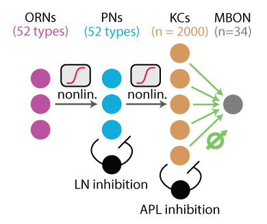

# mushroomBody
Code for simulating and analyzing a dynamic model of the mushroom body, including olfactory receptor neurons (ORNs), projection neurons (PNs), GABAergic local neurons (LNs) of the antennal lobe, Kenyon cells (KCs) and the GABAergic anterior paired lateral neuron (APL).

This repository is still under construction.

## Quick demo
This model simulates Kenyon cell responses to each of 110 odors from the [Hallem & Carlson ORN odor response dataset](https://www.sciencedirect.com/science/article/pii/S0092867406003631).

To run the model with default settings and get KC activations to one or more odors, add the mushroomBody repository to your Matlab search path and call `run_rate_model(odorList)` where odorList is a vector of indices between 1 and 110, corresponding to the odors you want to simulate in the Hallem & Carlson dataset. So `run_rate_model(1:110)` would simulate responses to all odors; `run_rate_model(94)` would only simulate responses to odor 94, which is isopentyl acetate.

To load/inspect the Hallem & Carlson dataset itself (with default settings), call `ORN = buildORNs({})`. The names of all odors are listed in `ORN.odornames`.

`run_rate_model` returns three variables:
- `KC_spikes`, an _N_ (# neurons) by _S_ (# odor stimuli) matrix whose entries reflect the number of spikes fired by each Kenyon cell in response to each odor in `odorList`.
- `fr_active`, an _S_-length vector of the number of Kenyon cells that responded to each odor.
- `odorspercell`, an _N_-length vector of the number of odors each Kenyon cell responded to.

## Experimenting with model settings
This repository contains code to reproduce all model variations presented in the paper. Use the script `run_rate_model_wrapper` to simulate multiple runs of the mushroom body model; parameters that can be varied are explained in `get_MB_default_settings`.

## Repository contents
- `analyses_from_paper` contains code for generating the plots in the paper.
- `constructing_model` contains code to initialize model ORNs, PNs, LNs, and KCs.
- `learning` contains scripts to experiment with learning and odor generalization by either a Perceptron or a biological learning rule.
- `simulation_helpers` are scripts called in the process of simulating Projection neuron and Kenyon cell dynamics.
- `util` are plotting/data-searching helper functions
